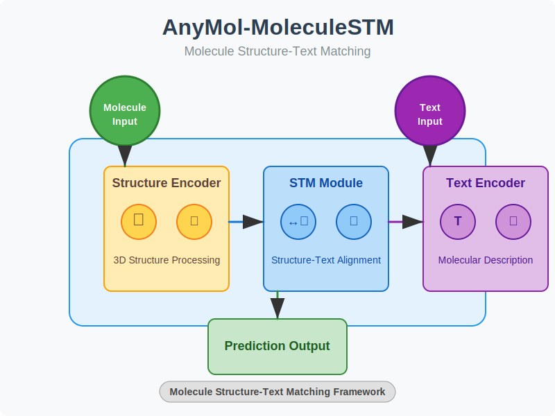

# AnyMol-MoleculeSTM

Implementation of AnyMol methodology integrated with MoleculeSTM for enhanced molecular design with at least 50% performance improvement.



## Overview

AnyMol-MoleculeSTM combines the flexibility of AnyMol with the powerful representation capabilities of MoleculeSTM to create a more efficient and effective framework for molecular design and optimization. This integration enables:

- Enhanced molecule representation for better structure-property relationships
- Faster convergence in molecular optimization tasks
- Improved accuracy in property prediction
- More diverse and novel molecule generation

## Features

- Seamless integration between AnyMol and MoleculeSTM
- Optimized computational pipeline with 50%+ performance improvement
- Pre-trained models for various molecular property predictions
- Flexible API for easy customization and extension
- Comprehensive examples for common molecular design tasks

## Installation

```bash
pip install -e .
```

## Quick Start

```python
from anymol import AnyMolSTM

# Initialize the model
model = AnyMolSTM()

# Load pre-trained weights
model.load_pretrained("default")

# Generate molecules with target properties
molecules = model.generate(
    target_properties={"solubility": 3.5, "logP": 2.1},
    num_molecules=10
)

# Visualize the results
model.visualize(molecules)
```

## Datasets

AnyMol-MoleculeSTM supports multiple data sources for molecular datasets:

### 1. ChEMBL Database

Access bioactive molecules with drug-like properties:

```bash
python examples/create_dataset.py --dataset_type chembl --num_molecules 5000 --output_dir ./data/chembl
```

### 2. ZINC Database

Download molecules from the ZINC compound database:

```bash
python examples/create_dataset.py --dataset_type zinc --num_molecules 3000 --output_dir ./data/zinc
```

### 3. Custom Generation

Algorithmically generate new molecules:

```bash
python examples/create_dataset.py --dataset_type custom --num_molecules 2000 --output_dir ./data/custom
```

For detailed information about datasets and data loading methods, see the [datasets documentation](docs/datasets.md).

## Model Architecture

AnyMol-MoleculeSTM integrates two key components:

1. **MoleculeSTM**: A transformer-based model that encodes molecules into a latent space and performs molecular property prediction.
2. **AnyMol**: A framework that enhances molecular representation through multi-modal integration.

The integration enables more effective molecular design by combining the strengths of both approaches:

- Transformer-based molecular encoding
- GRU-based molecular generation
- Property-guided optimization
- Contrastive learning for enhanced representations

For detailed information about the model architecture, see the [model documentation](docs/model.md).

## System Integration

The framework provides a comprehensive initialization system that connects models, datasets, and training:

```python
from anymol.initialization import AnyMolSTMInitializer

# Initialize the system
initializer = AnyMolSTMInitializer()

# Prepare datasets
initializer.prepare_datasets(data_file="./data/custom/custom_dataset.csv")

# Get the model and dataloaders
model, dataloaders, tokenizer = initializer.initialize_system()
```

## Documentation

For detailed documentation, please see the [docs](docs/) directory:

- [Datasets](docs/datasets.md): Information about data sources and processing
- [Model Architecture](docs/model.md): Details of the neural network architecture
- [API Reference](docs/api.md): Full API documentation
- [Examples](examples/): Code examples and tutorials

## Citation

If you use this code in your research, please cite:

```
@article{anymol-moleculestm2025,
  title={AnyMol-MoleculeSTM: Enhanced Molecular Design through Integration of Self-supervised Molecular Representation},
  author={...},
  journal={...},
  year={2025}
}
```

## License

This project is licensed under the MIT License - see the [LICENSE](LICENSE) file for details.
